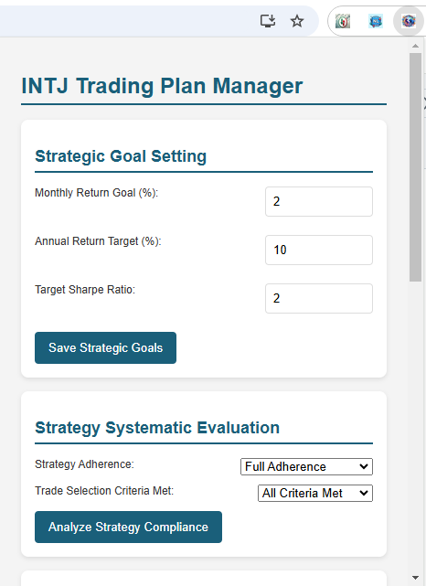

# INTJ Trading Plan Manager Chrome Extension

## Overview
A comprehensive trading management extension designed specifically for analytical minds, helping traders systematically track, evaluate, and improve their trading performance.

## Features
- Strategic Goal Setting
- Advanced Strategy Compliance Tracking
- Systematic Risk Management
- Analytical Learning Log
- Emotional Intelligence Tracking

## Installation
1. Clone the repository
2. Open Chrome Extensions (chrome://extensions/)
3. Enable "Developer Mode"
4. Click "Load Unpacked" and select the extension directory

## INTJ-Focused Design
Tailored for analytical personalities with:
- Objective performance tracking
- Systematic self-improvement framework
- Detailed metrics and compliance scoring

## Screenshots

## Key Metrics Tracked
- Monthly/Annual Return Goals
- Sharpe Ratio
- Strategy Adherence
- Risk Parameters
- Emotional State Analysis

## Requirements
- Chrome Browser
- Trading Platform Access

## Customize
Modify `popup.js` and `content.js` to match your specific trading workflow and platforms.